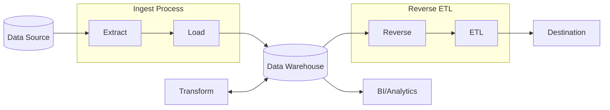

#seed

# Modern Data Stack

```mermaid
flowchart LR
    DS[(Data Source)]
    
    subgraph Ingest[Ingest Process]
        Extract[Extract]
        Load[Load]
    end
    
    Transform[Transform]
    DW[(Data Warehouse)]
    BI[BI/Analytics]
    
    subgraph RETL[Reverse ETL]
        Rev[Reverse]
        ETL[ETL]
    end
    
    Dest[Destination]
    
    %% Connections
    DS --> Extract
    Extract --> Load
    Load --> DW
    Transform <--> DW
    DW --> BI
    DW --> Rev
    Rev --> ETL
    ETL --> Dest
```